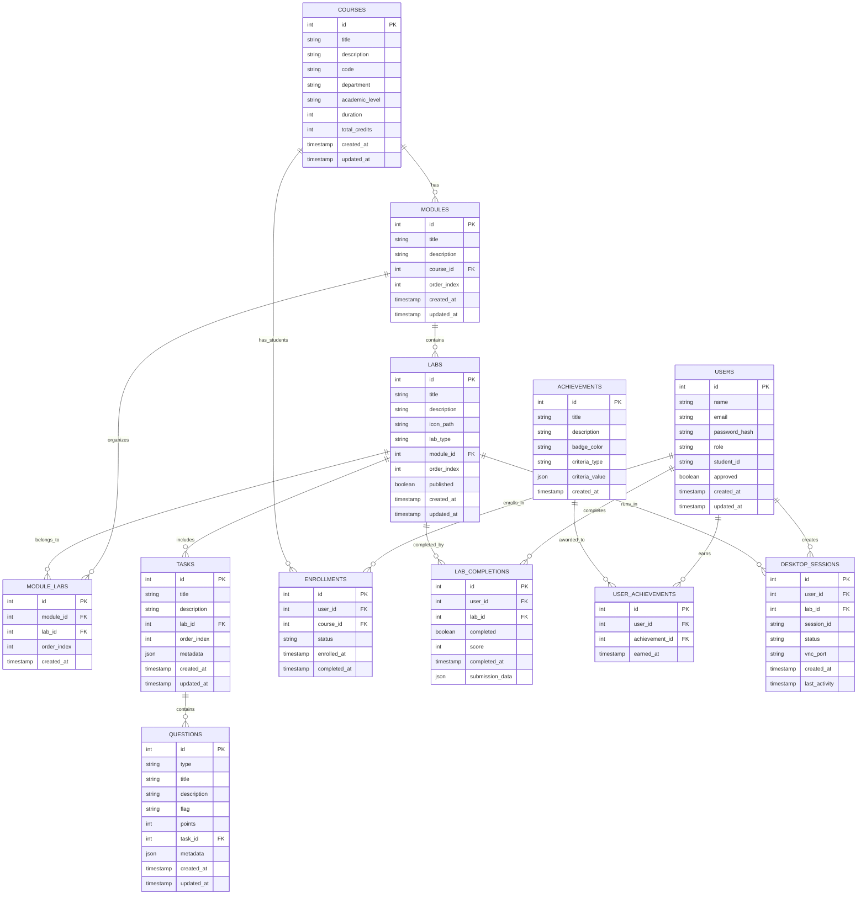
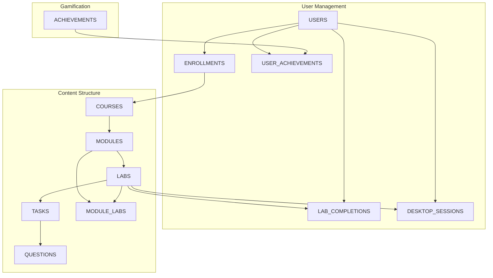
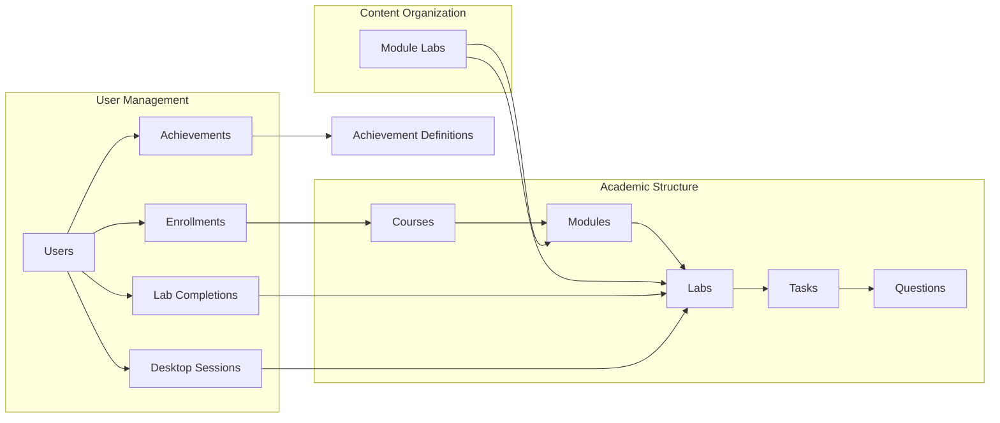

# Modulus LMS - Database Schema Diagram

## Database Entity Relationship Diagram

## Simplified Core Schema

## Table Relationships Overview

## Key Database Features

### 📊 **Core Tables**
- **USERS**: Student, instructor, admin, and staff accounts
- **COURSES**: Academic programs and degree structures
- **MODULES**: Course subdivisions and learning units
- **LABS**: Hands-on exercises and practical work
- **TASKS**: Individual lab components and activities
- **QUESTIONS**: Assessment items and interactive elements

### 🔗 **Relationship Tables**
- **ENROLLMENTS**: Student-course associations
- **MODULE_LABS**: Module-lab organization mapping
- **LAB_COMPLETIONS**: Student progress tracking
- **USER_ACHIEVEMENTS**: Gamification and badge system

### 🖥️ **System Tables**
- **DESKTOP_SESSIONS**: Virtual desktop management
- **ACHIEVEMENTS**: Badge and reward definitions

### 🎯 **Key Relationships**
1. **Hierarchical Content**: Courses → Modules → Labs → Tasks → Questions
2. **User Progress**: Users → Enrollments → Lab Completions
3. **Flexible Organization**: Module-Labs many-to-many relationship
4. **Gamification**: Users → Achievements for engagement
5. **Virtual Environment**: Desktop Sessions for lab execution

### 🔐 **Security Features**
- Role-based access control via user roles
- Enrollment-based course access
- Lab completion tracking for progress
- Session management for virtual desktops

This schema supports the full Modulus LMS functionality including course management, lab exercises, student progress tracking, achievements system, and virtual desktop integration.
