# Modulus LMS - User Activity Diagram

## System Overview
Modulus is a comprehensive Learning Management System focused on cybersecurity education with integrated Kali Linux environments and role-based access control.

## User Roles & Capabilities

### 🎓 Student
- **ID Range**: 1000-4999
- **Registration**: Requires staff approval
- **Access**: Course content, labs, personal progress

### 👨‍🏫 Instructor  
- **ID Range**: 500-999
- **Registration**: Requires staff approval
- **Access**: Course/lab creation, student management, submissions

### 👥 Staff
- **ID Range**: 100-499
- **Registration**: Requires approval
- **Access**: User management, course oversight, approvals

### 🔧 Admin
- **ID Range**: 1-99
- **Registration**: Auto-approved
- **Access**: Full system control, all user management

---

## User Activity Flow Diagram

```mermaid
graph TD
    A[🌐 User Visits Modulus] --> B{Already Registered?}
    
    B -->|No| C[📝 Registration Page]
    B -->|Yes| D[🔐 Login Page]
    
    C --> C1[Select Role]
    C1 --> C2[Fill Registration Form]
    C2 --> C3[Submit with Access Code]
    C3 --> C4{Role Check}
    
    C4 -->|Admin| C5[✅ Auto-Approved]
    C4 -->|Student/Instructor/Staff| C6[⏳ Pending Approval]
    
    C5 --> D
    C6 --> C7[📧 Wait for Staff Approval]
    C7 --> C8[Staff Reviews in Dashboard]
    C8 --> C9{Approve?}
    C9 -->|Yes| C10[✅ Account Activated]
    C9 -->|No| C11[❌ Account Rejected]
    C10 --> D
    
    D --> D1[Enter Credentials]
    D1 --> D2{Valid Login?}
    D2 -->|No| D3[❌ Error Message]
    D2 -->|Yes| D4{Account Approved?}
    D4 -->|No| D5[⏳ Pending Approval View]
    D4 -->|Yes| D6[🎯 Role-Based Dashboard]
    
    D3 --> D
    D5 --> E[End Session]
    
    D6 --> S[👤 Student Dashboard]
    D6 --> I[👨‍🏫 Instructor Dashboard]
    D6 --> T[👥 Staff Dashboard]
    D6 --> M[🔧 Admin Dashboard]
    
    %% Student Flow
    S --> S1[📚 Browse Courses]
    S --> S2[🎯 View Enrolled Courses]
    S --> S3[👤 Profile Management]
    
    S1 --> S4[🔍 Course Details]
    S4 --> S5[📝 Request Enrollment]
    S5 --> S6[⏳ Wait for Approval]
    
    S2 --> S7[📖 Course Content]
    S7 --> S8[📋 Modules & Labs]
    S8 --> S9[🧪 Start Lab]
    
    S9 --> S10[🖥️ Kali Desktop Session]
    S10 --> S11[🛠️ Lab Environment]
    S11 --> S12[📝 Complete Tasks]
    S12 --> S13[💾 Submit Answers]
    S13 --> S14[🏆 Receive Feedback]
    S14 --> S15[📊 Progress Tracking]
    
    S10 --> S16[🔧 Docker Container]
    S16 --> S17[🐧 Kali Linux Tools]
    S17 --> S18[💾 Persistent Storage]
    
    %% Instructor Flow
    I --> I1[📚 Course Management]
    I --> I2[🧪 Lab Creation]
    I --> I3[👥 Student Oversight]
    I --> I4[🏆 Achievement System]
    
    I1 --> I5[➕ Create Course]
    I1 --> I6[✏️ Edit Course]
    I1 --> I7[📋 Manage Modules]
    
    I2 --> I8[🎯 Lab Designer]
    I8 --> I9[📝 Add Tasks]
    I9 --> I10[❓ Create Questions]
    I10 --> I11[🚀 Deploy Lab]
    
    I3 --> I12[📊 View Submissions]
    I3 --> I13[📈 Progress Analytics]
    I3 --> I14[💬 Provide Feedback]
    
    I4 --> I15[🎖️ Create Achievements]
    I15 --> I16[🎯 Set Criteria]
    I16 --> I17[🏆 Award Students]
    
    %% Staff Flow
    T --> T1[👥 User Management]
    T --> T2[✅ Approve Accounts]
    T --> T3[📚 Course Oversight]
    T --> T4[📊 System Metrics]
    
    T1 --> T5[➕ Create Users]
    T1 --> T6[✏️ Edit User Data]
    T1 --> T7[🔄 Role Management]
    
    T2 --> T8[📋 Pending Approvals]
    T8 --> T9{Review Application}
    T9 -->|Approve| T10[✅ Activate Account]
    T9 -->|Reject| T11[❌ Delete Account]
    
    T3 --> T12[👀 Course Analytics]
    T3 --> T13[📊 Enrollment Stats]
    T3 --> T14[🛠️ Course Management]
    
    %% Admin Flow
    M --> M1[🌐 Full System Control]
    M --> M2[👥 All User Management]
    M --> M3[⚙️ System Configuration]
    M --> M4[📊 Global Analytics]
    
    M1 --> M5[🔧 Database Management]
    M1 --> M6[🛠️ Server Configuration]
    M1 --> M7[🔐 Security Settings]
    
    M2 --> M8[👑 Create Any Role]
    M2 --> M9[🔄 Role Transfers]
    M2 --> M10[📊 User Analytics]
    
    %% Lab Environment Flow
    S10 --> L1[🖥️ Container Creation]
    L1 --> L2[🐧 Kali Linux Boot]
    L2 --> L3[🔧 Tool Initialization]
    L3 --> L4[💾 Data Restoration]
    L4 --> L5[🌐 noVNC Interface]
    L5 --> L6[🖱️ Desktop Environment]
    
    L6 --> L7[🛠️ Security Tools]
    L7 --> L8[🔍 nmap Scanning]
    L7 --> L9[🌐 Burp Suite]
    L7 --> L10[🔒 Metasploit]
    L7 --> L11[📡 Wireshark]
    
    L6 --> L12[📁 File System]
    L12 --> L13[💾 Persistent ~/Documents]
    L12 --> L14[🔧 ~/Scripts]
    L12 --> L15[📂 ~/Projects]
    
    L6 --> L16[🔚 Session End]
    L16 --> L17[💾 Auto-Save Progress]
    L17 --> L18[🗑️ Container Cleanup]
    
    %% Submission & Progress Flow
    S13 --> P1[📝 Answer Validation]
    P1 --> P2{Correct Answer?}
    P2 -->|Yes| P3[✅ Points Awarded]
    P2 -->|No| P4[❌ Try Again]
    P3 --> P5[📊 Progress Update]
    P5 --> P6[🎯 Lab Completion Check]
    P6 --> P7{All Tasks Complete?}
    P7 -->|Yes| P8[🏆 Lab Completed]
    P7 -->|No| P9[➡️ Next Task]
    P8 --> P10[📈 Course Progress]
    P10 --> P11[🎖️ Achievement Check]
    
    %% Navigation Flow
    S --> N1[🧭 Navigation Menu]
    I --> N1
    T --> N1
    M --> N1
    
    N1 --> N2[🏠 Dashboard]
    N1 --> N3[📚 Courses]
    N1 --> N4[🧪 Labs]
    N1 --> N5[👤 Profile]
    N1 --> N6[🚪 Logout]
    
    %% Conditional Navigation
    N1 --> N7{Role Check}
    N7 -->|Student| N8[📖 My Courses]
    N7 -->|Instructor| N9[➕ Create Course]
    N7 -->|Staff| N10[👥 User Management]
    N7 -->|Admin| N11[⚙️ Admin Panel]
    
    %% Error Handling
    D3 --> EH1[🚨 Error Handling]
    C11 --> EH1
    S6 --> EH2[⏳ Waiting States]
    C7 --> EH2
    
    EH1 --> EH3[📧 Error Notifications]
    EH2 --> EH4[📧 Status Updates]
```

---

## Detailed Activity Breakdown

### 🔐 Authentication Flow
1. **Registration Process**
   - User selects role (Student/Instructor/Staff/Admin)
   - Provides name, email, password, and role-specific access code
   - Admin accounts: Auto-approved
   - All others: Require staff approval

2. **Login Process**
   - JWT-based authentication
   - Role-based dashboard redirection
   - Session persistence with Zustand

3. **Approval Workflow**
   - Staff reviews pending accounts in dashboard
   - Can approve/reject with single click
   - Email notifications sent to users

### 🎓 Student Activities
1. **Course Discovery & Enrollment**
   - Browse available courses
   - View course details and modules
   - Request enrollment (requires approval)

2. **Lab Participation**
   - Access enrolled course content
   - Launch Kali Linux environments
   - Complete interactive tasks
   - Submit answers and receive feedback

3. **Progress Tracking**
   - View completion percentages
   - Track achievements and badges
   - Monitor lab scores and streaks

### 👨‍🏫 Instructor Activities
1. **Course Creation**
   - Design course structure with modules
   - Create lab content with tasks and questions
   - Set point values and difficulty levels

2. **Student Management**
   - View student submissions
   - Provide feedback and grades
   - Monitor progress analytics

3. **Achievement System**
   - Create custom achievements
   - Set completion criteria
   - Award badges to students

### 👥 Staff Activities
1. **User Administration**
   - Approve/reject new accounts
   - Create user accounts directly
   - Manage user roles and permissions

2. **Course Oversight**
   - Monitor course enrollment
   - View system-wide analytics
   - Assist with course management

### 🔧 Admin Activities
1. **System Management**
   - Full database access
   - User role management
   - System configuration

2. **Advanced Features**
   - Create any user type
   - Modify system settings
   - Access global analytics

### 🖥️ Lab Environment
1. **Container Management**
   - Automatic Docker container creation
   - Kali Linux desktop via noVNC
   - Persistent storage for user data

2. **Tool Integration**
   - Pre-installed security tools (nmap, Burp Suite, etc.)
   - File system persistence
   - Session management

3. **Resource Management**
   - Memory limits (3GB per container)
   - Automatic cleanup after 2 hours
   - Port management for multiple users

---

## Key Technical Features

### 🔒 Security & Access Control
- Role-based permissions system
- JWT authentication with refresh tokens
- Secure container isolation
- Access code validation

### 📊 Progress & Analytics
- Real-time submission tracking
- Completion percentages
- Achievement system with badges
- Performance analytics

### 🛠️ Infrastructure
- Docker-based lab environments
- PostgreSQL database
- Next.js frontend with TypeScript
- Express.js backend with comprehensive APIs

### 🎯 User Experience
- Responsive dashboard design
- Real-time feedback
- Progressive lab difficulty
- Persistent learning environment

This diagram represents the complete user journey through the Modulus LMS, from initial registration to advanced lab completion, with all role-based interactions and technical integrations clearly mapped out.
